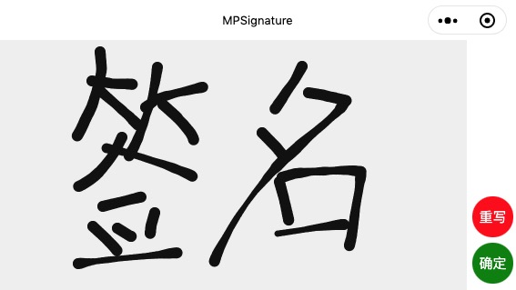
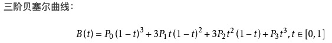

# 微信小程序签名组件

最近在研究在微信小程序上实现签名这一功能, 最终效果图:

## 介绍

这个仓库就是一个微信小程序, 用微信开发者工具直接打开就可以看到效果.

在这个工程中, 我把签名部分专门做成了一个组件 `MPSignature` , 可以像 index 界面一样照例使用或直接使用index这个界面.

## MPSignature 使用说明

MPSignature 可以设置以下属性:

* fillStyle 画笔颜色
* backgroundColor 签名板的背景色, 要设置背景透时，可以加 alpha , 如 #FFFFFF00
* penPointRadius 画笔尖的大小, 默认为6
* clipping 剪切, 为true时，生成签名图片时会把多余的空白边框去掉

MPSignature 对外提供的方法:

* clearCanvas 清白画板, 重新签名
* genSignatureImg 生成签名的微信临时图片文件

## MPSignature 实现原理大概说明

以下对实现思路及原理作一个介绍说明, 作为记录

* MPSignature 就是一个 canvas 不断接收触摸事件. 有了触摸move事件, 就会有一系列的触摸点 point.

* MPSignature然后现在问题就可以变成了在已知点位置的情况下, 如何画一条曲线, 让这个曲线经过已知点.

* 这里我使用贝塞尔曲线来经过这些点.

* 一条贝塞尔曲线有两个锚点(也就是曲线的开始结束点), 还要知道这两个锚点对应的控制点.

* 控制点的计算可以参考[文章1](http://antigrain.com/research/bezier_interpolation/index.html#PAGE_BEZIER_INTERPOLATION), [文章2](https://www.iteye.com/blog/liyiwen-705489)

* 如果不实现笔锋(实际签名的线段不同时候是不同粗细的)就不用往下看了

* 要实现笔锋, 因为没法知道触摸点的压力, 所以可以用速度来代替, 当触摸点的速度快，就应该细一点，慢就应该粗一些

* 曲线的线段有粗细的改变, 每两个触摸点之间的距离可能会比较远, 那么这时就应该在两个触摸点之间用贝塞尔来取插值, 增加线宽的变化, 让最终的线段宽度变化更平滑.

* 贝塞尔的插值, 根据贝塞尔的公式来就好, 程序中使用的是三阶贝塞尔, 它的公式如下([这里](https://www.jianshu.com/p/55099e3a2899) 也有介绍.):

## 程序实现时参考过以下资料

https://wenku.baidu.com/view/c790f8d46bec0975f565e211.html

https://www.jianshu.com/p/55099e3a2899

https://www.iteye.com/blog/liyiwen-705489

http://antigrain.com/research/bezier_interpolation/index.html#PAGE_BEZIER_INTERPOLATION

